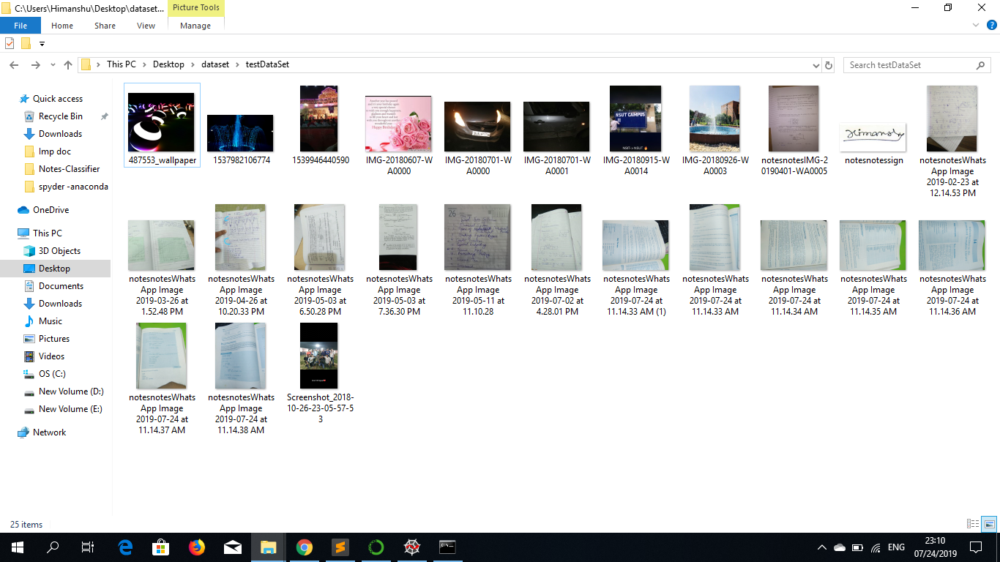
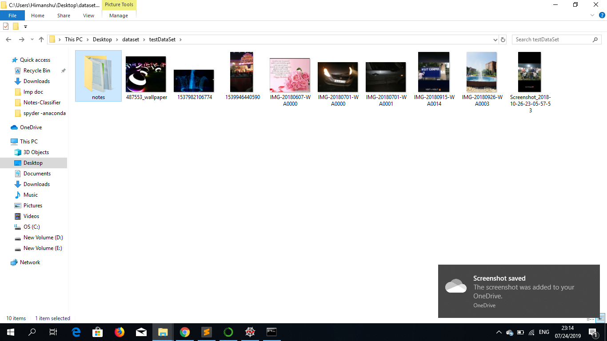

# Notes-Classifier

Basically we all have some kind unwanted images in a image folder in my case it was my notes images, So one can also this idea in classifying screenshots etc.

This project will extract your images of notes from general images folder using Convolution Nueral Network.

I have prepared dataset of 1K images of notes by my own and got 98% accuracy! 

Before Applying CNN model my folder(for the testing purpose) lokks like this :

But after applying the CNN model it solves my problem! the scenario is :

Requirements:

* Keras
* numpy
* os
* glob

I've trained the model on about 1000 images and using Keras' data augmentation pipeline. Currently the model is 98% accurate on my dataset. Please feel free to add your own data and train the model on it to make the model more accurate. 

Feel free to open up an issue if you wanna contribute or know something about this project.

Enjoy!